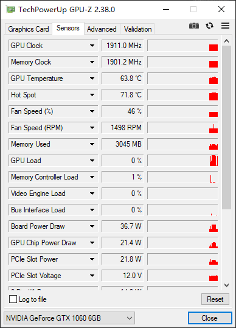

# awesome-gamedev
<!-- TOC -->

- [awesome-gamedev](#awesome-gamedev)
    - [:loudspeaker:说明](#loudspeaker说明)
    - [📚书籍](#📚书籍)
    - [:computer:博客](#computer博客)
    - [:computer:工程](#computer工程)
    - [:rocket:GPU](#rocketgpu)
    - [:mag:Paper](#magpaper)
    - [:mount_fuji:图形学](#mount_fuji图形学)
        - [烘焙和离线渲染](#烘焙和离线渲染)
        - [实时渲染](#实时渲染)
    - [性能优化](#性能优化)
    - [GamePlay](#gameplay)
    - [网络](#网络)
    - [工具](#工具)
        - [IDE](#ide)
        - [有趣的](#有趣的)

<!-- /TOC -->
## :loudspeaker:说明
 收集游戏进阶的 文章 demo 教程等等

## 📚书籍
|书名|地址|介绍|
|-|-|-|
||链接：https://pan.baidu.com/s/1SRPqDrdbXTttnO-6Z2PtHQ 提取码：wlxk ||

## :computer:博客 
|博客|地址|介绍|
|-|-|-|
|云风博客|http://blog.codingnow.com/||

## :computer:工程 
|工程demo|地址|介绍|
|-|-|-|
|GPULightmass|https://github.com/AlanIWBFT/GPULightmass||

## :rocket:GPU
- CUDA（未读）：
https://blog.csdn.net/chengyq116/article/details/105919991
https://zhuanlan.zhihu.com/p/34587739

## :mag:Paper
这里有挺多文章
http://www.ppsloan.org/publications/

这个是讲球谐函数的文章：
It was introduced in a paper at Siggraph 2002
by Sloan, Kautz and Snyder as a technique for ultra realistic
lighting of models
http://www.cse.chalmers.se/~uffe/xjobb/Readings/GlobalIllumination/Spherical%20Harmonic%20Lighting%20-%20the%20gritty%20details.pdf

球谐函数 里面有UE的推导
https://zhuanlan.zhihu.com/p/350057737

UE的shader代码：
https://zhuanlan.zhihu.com/p/36031421

Stupid SH:
https://www.ppsloan.org/publications/StupidSH36.pdf

SH生成DirectionalMap：
简述：讲述了SH L1怎么可以更加真实 这样就可以只用4个参数.
https://liye.info/docdownloadv2-reconstructing-diffuse-lighting-from-spherical-harmonic-geomerics-pr_9ab504d8f0a0555e06b42fad4cc3d5b3

球谐函数：
https://community.arm.com/cfs-file/__key/telligent-evolution-components-attachments/01-2066-00-00-00-01-27-70/Simplifying_2D00_Spherical_2D00_Harmonics_2D00_for_2D00_Lighting.pdf

迪士尼
https://media.disneyanimation.com/uploads/production/publication_asset/48/asset/s2012_pbs_disney_brdf_notes_v3.pdf

蒙特卡洛积分在光追的应用：
For more, see Siggraph 2001, “State of
the Art in Monte Carlo Ray Tracing”,
Course 29 
Peter Shirley,”Realistic Ray Tracing”,
A. K. Peters, 2001 

Matt Pharr, “Design of a Realistic Image
Synthesis System”, 2002, available at
http://graphics.stanford.edu/~mmp
/book.pdf 

## :mount_fuji:图形学
- 预计算光照信息（Precomputed Radiance Tranfer,简称PRT）

- DirectionMap
简述：Unity的描述
https://docs.unity3d.com/530/Documentation/Manual/LightmappingDirectional.html

- MTL Metropolis Light Transport ?
https://blog.csdn.net/libing_zeng/article/details/77239332
- GPULightmass
https://github.com/AlanIWBFT/GPULightmass
- mitsuba2 ？
- 光追github ?
https://github.com/Mike-Leo-Smith
- optix7 官方demo?
- lightprobe
简述：文章末尾数了Unity的光照探针 然后提到了ShadeSH9这个函数
https://www.jianshu.com/p/6dfe403f75f6
简述：Unity里面内置函数ShadeSH9 也解释了光照探针原理
https://gameinstitute.qq.com/community/detail/124147
- 距离场？？（后面看光追 路径追踪再看）：
- ray matching？？（后面看光追 路径追踪再看）：

- 2U展开：
简述：从Unity的角度来解释2U 展开 然后说了怎么解决黑边问题
https://www.jianshu.com/p/8e98414d601c
简述：Unreal里面怎么只是2U
https://docs.unrealengine.com/zh-CN/WorkingWithContent/Types/StaticMeshes/LightmapUnwrapping/index.html
简述：生成唯一UV坐标的纹理 适合lightmap的烘焙的一个github仓库
https://github.com/jpcy/xatlas

- 层次包围盒（BVH）：
简述：大致了解BVH 公式推导还是要看game101里面的讲解
https://zhuanlan.zhihu.com/p/36439822
- 全局光照初步认识（Global illumination，简称GI）：https://zhuanlan.zhihu.com/p/126362480
- 球面高斯（(Spherical Gaussian, 简称SG）（未读）：
翻译：https://cuihongzhi1991.github.io/blog/2020/05/05/sg05/    
英文：https://mynameismjp.wordpress.com/2016/10/09/sg-series-part-1-a-brief-and-incomplete-history-of-baked-lighting-representations/

- 3D空间中射线与轴向包围盒AABB的交叉检测算法
https://blog.csdn.net/i_dovelemon/article/details/38342739

- 图形学视频:
简述：Games101 图形学基础
https://www.bilibili.com/video/BV1X7411F744
简述：Games201 物理
https://www.bilibili.com/video/BV1ZK411H7Hc/?spm_id_from=autoNext
简述：Games202 实时渲染
https://www.bilibili.com/video/BV1YK4y1T7yY

### 烘焙和离线渲染
- 烘焙器：
Bakery
Enlighten 
Progressive 
Progressive :lightmap在uv空间做filter

- Unity 烘焙学习
https://zhuanlan.zhihu.com/p/78706246

- 辐射度算法(radiosity)）：
简述：非常易懂介绍了辐照度算法 但是没有细节到算法推导 就是感光的认识
https://blog.csdn.net/kuangben2000/article/details/82955658

- 烘焙漏光：
这里就是说加大lightmap分辨率
https://www.bilibili.com/video/av96889514/

- UE4烘焙
简述：
https://papalqi.cn/2020/ue4-lightmass%E6%95%B0%E6%8D%AE%E6%B5%81%E7%A8%8B/

https://zhuanlan.zhihu.com/p/72086470

https://blog.csdn.net/u013412391/article/details/106457631

- 烘焙
简述：lightmap UV空间不连续 geometry上连续 导致的过度有缝
https://zhuanlan.zhihu.com/p/81198807

### 实时渲染

## 性能优化

## GamePlay

## 网络

## 工具
### IDE
vs2017的resharper插件：
https://www.jianshu.com/p/494bdde2a431
GPU -Z：

shaderred：
shader调试工具
https://shadered.org/docs/debugger.html

- Substance Painter ？？

### 有趣的

https://www.thisfaner.com/o/git-emoji/

GLSL查询：
https://github.com/wshxbqq/GLSL-Card/blob/master/README.md