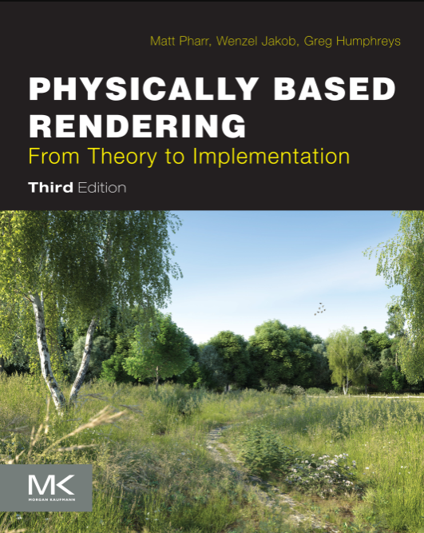
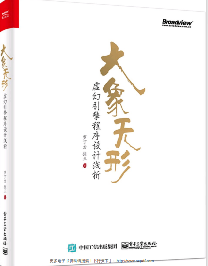
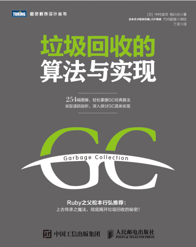
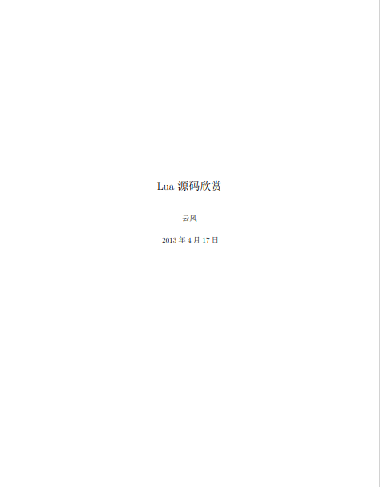
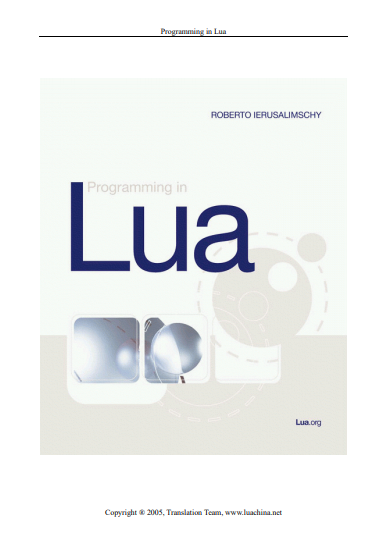
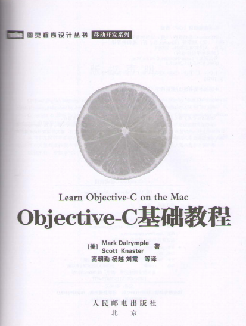
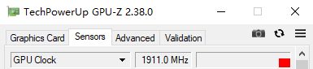

# awesome-gamedev
<!-- TOC -->

- [awesome-gamedev](#awesome-gamedev)
    - [:loudspeaker:说明](#loudspeaker说明)
    - [📚书籍](#📚书籍)
    - [:computer:博客](#computer博客)
    - [:computer:工程](#computer工程)
    - [:rocket:GPU](#rocketgpu)
    - [:mag:Paper](#magpaper)
    - [:mount_fuji:图形学](#mount_fuji图形学)
        - [烘焙和离线渲染](#烘焙和离线渲染)
        - [实时渲染](#实时渲染)
    - [引擎](#引擎)
        - [Unreal](#unreal)
        - [Unity](#unity)
    - [数学](#数学)
    - [性能优化](#性能优化)
    - [GamePlay](#gameplay)
    - [网络](#网络)
    - [C++](#c)
    - [工具](#工具)
        - [IDE](#ide)
        - [有趣的](#有趣的)
        - [TODO](#todo)

<!-- /TOC -->
## :loudspeaker:说明
 收集游戏进阶的、paper、demo、教程等等

## 📚书籍
|书名|地址|介绍|
|-|-|-|
||链接：https://share.weiyun.com/57krWlgp 密码：wlxk|《Physically Based Rendering Third Edition》离线渲染必读|
||链接：https://share.weiyun.com/uZXkQaGz 密码：wlxk |《大象无形》从事Unreal源码相关工作 初学者可以看下|
||链接：https://share.weiyun.com/6pd557VZ 密码：wlxk|《垃圾回收的算法与实现》从事Java、C#、lua、python等带有GC的语言开发 可以读此书来了解GC|
||链接：https://share.weiyun.com/WjeOnX7T 密码：wlxk|《readinglua》|
||链接：https://share.weiyun.com/wM7ukZeM 密码：wlxk|《Programming in Lua-中文》|
||链接：https://share.weiyun.com/Rmqx41B1 密码：wlxk|《Objective-C基础教程》|
||链接：https://share.weiyun.com/YilKye1n 密码：wlxk|《程序员的自我修养》|

## :computer:博客 
|博客|地址|介绍|
|-|-|-|
|云风博客|http://blog.codingnow.com/||
|韦一笑博客|http://www.skywind.me/blog/||


## :computer:工程 
|工程demo|地址|介绍|
|-|-|-|
|GPULightmass|https://github.com/AlanIWBFT/GPULightmass||
|Unity后处理|https://github.com/wlxklyh/awesome-gamedev/tree/main/demo/Unity/postprocess|wlxklyh 的后处理demo工程|
|Unity Progressive|https://github.com/wlxklyh/awesome-gamedev/tree/main/demo/Unity/progressive|wlxklyh 的progressive 烘焙demo工程|
|shadertoy里面写pt|https://blog.demofox.org/2016/09/21/path-tracing-getting-started-with-diffuse-and-emissive/||

## :rocket:GPU

|文章|简述|链接|难度|
|-|-|-|-|
|CUDA |CUDA的安装和一些基础命令|https://blog.csdn.net/chengyq116/article/details/105919991|:star:|
|CUDA编程入门极简教程|入门教程|https://zhuanlan.zhihu.com/p/34587739|:star:|
|CUDA 教程|从第七集开始看 前面很多觉得不是很有必要的东西 到12集就差不多了|https://www.bilibili.com/video/BV1kx411m7Fk?p=1  |:star::star:|


## :mag:Paper

|文章|简述|链接|难度|
|-|-|-|-|
|Siggraph的一些文章集合|Siggraph的一些文章集合|http://www.ppsloan.org/publications/||
|球谐函数 L2怎么更接近真实| 这里介绍了L2的球谐函数怎么更加接近真实 避免ringing(例如一个光和一个球 球背光面应该是漫反射 但是全黑了就叫ringing) |http://www.cse.chalmers.se/~uffe/xjobb/Readings/GlobalIllumination/Spherical%20Harmonic%20Lighting%20-%20the%20gritty%20details.pdf|:star::star:|
|Stupid SH|讲SH（没看）|https://www.ppsloan.org/publications/StupidSH36.pdf|没看|
|球谐函数||https://community.arm.com/cfs-file/__key/telligent-evolution-components-attachments/01-2066-00-00-00-01-27-70/Simplifying_2D00_Spherical_2D00_Harmonics_2D00_for_2D00_Lighting.pdf|粗略看了|
|迪士尼||https://media.disneyanimation.com/uploads/production/publication_asset/48/asset/s2012_pbs_disney_brdf_notes_v3.pdf|没看|
|State of the Art in Monte Carlo Ray Tracing|蒙特卡洛积分在光追的应用||没看|


## :mount_fuji:图形学


- 球谐函数  
**简述：** 这里讲解了UE球谐函数的推导 （还没怎么看懂）  
https://zhuanlan.zhihu.com/p/350057737  
UE的shader代码：  
https://zhuanlan.zhihu.com/p/36031421

- 预计算光照信息（Precomputed Radiance Tranfer,简称PRT）

- DirectionMap  
**简述：** 方向图在Unity的描述  
https://docs.unity3d.com/530/Documentation/Manual/LightmappingDirectional.html

- Metropolis Light Transport（MTL）  
**简述：** 这里讲了Basic PT、monte carlo light tracing、bidirectional path tracing、original metropoli light Transport、 PSSMLT  
https://blog.csdn.net/libing_zeng/article/details/77239332  
详细：
    |类别|介绍|缺点|光线出发||
    |-|-|-|-|-|
    |basic path tracing:|视口射线 然后不断反射 射中光源则为有效| 效率很低 很多无效射线|视口出发||
    |whitted style ray tracing|视口出发 碰撞到物体 如果是反射则反射光线 折射则折射光线 否则跟所有光源做着色（这里跟材质有关吗）|比basic提高了效率 直接跟光源做着色|视口出发|[1.论文 ](https://dl.acm.org/doi/pdf/10.1145/1198555.1198743?casa_token=4_Nc6cE-x3sAAAAA:H3FMuWi6Gqrf2K9vMKoeBUBDzgMtSh--aTxobWfk2em89HwusQ4HwYJx1DZ-jM9gptUk_icWionfS78) [2. 论文](https://www.scratchapixel.com/lessons/3d-basic-rendering/ray-tracing-overview/light-transport-ray-tracing-whitted) [3. 代码强烈推荐](https://www.scratchapixel.com/code.php?id=8&origin=/lessons/3d-basic-rendering/ray-tracing-overview)|
    |Monte Carlo Path Tracing|从光源出发 在场景中反弹 每次击中场景中的物体表面 判断下能否跟视口连线成为有效路径 | 视口只是场景的一小部分的时候 光源出发的射线很多都浪费了 小光源有优势|光源出发|[1.Monte Carlo Path Tracing](http://www.graphics.stanford.edu/courses/cs348b-01/course29.hanrahan.pdf)|
    |bidirectional path tracing|综合前面的从光源和视口发出射线 |着色位置跟光源间隔了几个房间 那么还是很难搜索到有效路径|光源和视口出发||
    |metropolis Light transport|如果已经有一条有效路径 那么相邻位置大概率也是有效||光源和视口出发||
    |PSSMLT|针对变异函数进行改进 对随机数扰动 减少噪点||光源和视口出发||
    
- GPULightmass  
**简述：** Luoshuang's GPULightmass for UE4 用辐照度算法、CUDA做的GPU Lightmass  
https://github.com/AlanIWBFT/GPULightmass
- mitsuba2  
**简述：** 开源渲染器 知乎说几个小时可以看懂代码

- 光追github   
**简述：** 清华学生的github 写了光追的渲染器  
https://github.com/Mike-Leo-Smith
- optix7 官方demo
**简述：** 没看
  
- lightprobe  
**简述：** 文章末尾数了Unity的光照探针 然后提到了ShadeSH9这个函数  
https://www.jianshu.com/p/6dfe403f75f6  
简述：Unity里面内置函数ShadeSH9 也解释了光照探针原理  
https://gameinstitute.qq.com/community/detail/124147  
- 距离场？？（后面看光追 路径追踪再看）：
**简述：** 没查  

- ray matching？？（后面看光追 路径追踪再看）：
**简述：** 没查  

- 2U展开：  
**简述：** 从Unity的角度来解释2U 展开 然后说了怎么解决黑边问题  
https://www.jianshu.com/p/8e98414d601c  
**简述：** Unreal里面怎么只是2U  
https://docs.unrealengine.com/zh-CN/WorkingWithContent/Types/StaticMeshes/LightmapUnwrapping/index.html  
**简述：** 生成唯一UV坐标的纹理 适合lightmap的烘焙的一个github仓库  
https://github.com/jpcy/xatlas  

- 层次包围盒（BVH）：  
**简述：** 大致了解BVH 公式推导还是要看game101里面的讲解
https://zhuanlan.zhihu.com/p/36439822

- 全局光照初步认识（Global illumination，简称GI）：  
**简述**: 初学者看理解一些概念比较合适 这篇比较简单和比较应用类型   
https://zhuanlan.zhihu.com/p/126362480

- 球面高斯（(Spherical Gaussian, 简称SG）（未读）： 
**翻译：** https://cuihongzhi1991.github.io/blog/2020/05/05/sg05/     
英文：https://mynameismjp.wordpress.com/2016/10/09/sg-series-part-1-a-brief-and-incomplete-history-of-baked-lighting-representations/
 
- 3D空间中射线与轴向包围盒AABB的交叉检测算法  
**简述：** 初学者看 GAMES101里面也讲的很好 
https://blog.csdn.net/i_dovelemon/article/details/38342739

- 图形学视频:    
**简述：**Games101 图形学基础  
https://www.bilibili.com/video/BV1X7411F744  
**简述：** Games201 物理  
https://www.bilibili.com/video/BV1ZK411H7Hc/?spm_id_from=autoNext  
**简述：** Games202 实时渲染  
https://www.bilibili.com/video/BV1YK4y1T7yY  

### 烘焙和离线渲染  


|文章|简述|链接|难度|
|-|-|-|-|
|光线追踪|总结了光线追踪的算法 有一定基础后看|https://zhuanlan.zhihu.com/p/72673165|:star::star::star:|
- pbrt3  
**简述：** pbrt3的资源文件  
https://benedikt-bitterli.me/resources/  


- 各种烘焙器：  
    - Bakery   
    **简述：** 这个是插件 要60美元 不过挺多项目使用 
    - Enlighten   
    **简述：** 这个就是旧版本的Progressive   
    - Progressive Unity5.6开始   
    Progressive UV空间的Filter  
    **简述：** lightmap在uv空间做filter可以看下源码   
    CPU Progressive 教程：https://www.bilibili.com/video/BV1At411172s  
    GPU Progressive 教程：https://www.bilibili.com/video/BV1j4411U7KB  

 
- Blender  建模工具
https://zhuanlan.zhihu.com/p/146665394  


- Unity 烘焙学习  
https://zhuanlan.zhihu.com/p/78706246  

- 辐射度算法(radiosity)）：  
**简述：** 非常易懂介绍了辐照度算法 但是没有细节到算法推导 就是感光的认识  
https://blog.csdn.net/kuangben2000/article/details/82955658  

- 烘焙漏光：  
**简述：** 这里就是说加大lightmap分辨率  
https://www.bilibili.com/video/av96889514/  


- 烘焙UV的Filter  
**简述：** lightmap UV空间不连续 geometry上连续 导致的过度有缝  
https://zhuanlan.zhihu.com/p/81198807  


### 实时渲染  
- 光照系统  
```cpp
传统光照系统 
    1.punctual lighting
        1. 太阳光（阴影） 
        2. 点光
            1. 前向渲染 forward tilebased light
            2. 延迟渲染 deferred one pass for one light
    2.global illumination
        1. 动态 
            1.diffuse light probe
            2.specular IBL 
        2. 静态    
            1.diffuse lightmap
            2.specular IBL （reflection probe然后还要插值） 手机插值多个需要采样多个IBL
    3.Ambient  only flat color
缺陷：
    1. 需要多个reflection probe来插值 从而表现高光 这样受到手机内存和性能的制约 最多用几个 而且没插值（插值要采样多个）
    2. 摆的不多会导致看起来不能量守恒
    3. 烘焙的diffuse 没有法线效果（UE4 和 U3d有低阶球谐来代表方向）
    4. Ambient没有高光效果 所以非能量守恒
解决：
    1. Radiosity Normal Mapping 存储三个方向的光
    2. 球谐lightmap 球谐light probe:
```


- Radiosity Normal Mapping  
    - avoid flat Ambient.   
    - three full RGB lighting values in three directions in TS  
    - ok with rough spec not with low roughness

## 引擎  
### Unreal  

|Trick|简述|链接|
|-|-|-|
|UE shader编译选项|UE配置ConsoleVariable.ini之后就可以在renderdoc里面看到非汇编的shader 三个选项：r.Shaders.Optimize=0 r.Shaders.KeepDebugInfo=1 r.DisableEngineAndAppRegistration=1|http://aicdg.com/renderdoc-hlsl/ https://zhuanlan.zhihu.com/p/47075752（这里也有提到）|
|UE编译加速|使用SSD链接 正常编译的时候I/O也会成为你的瓶颈，如果没有足够的ssd空间存放引擎和工程可以通过一些骚操作达到类似效果，你只需要把生成的中间文件和源文件联接到SSD上即可  mklink /J E:\ue_4.25\Engine\Intermediate C:\UEBuild\Intermediate  mklink /J E:\ue_4.25\Engine\Source C:\UEBuild\Source|https://cloud.tencent.com/developer/article/1368057|
|UE编译 重编|修改buildconfiguration会导致全部重编 修改头文件会导致大量重编 ||
|UE编译 联合编译|Incrediblebuild 200个CPU一起跑 SSD固态硬盘 20分钟可以编完UE4工程|
|UE模块 依赖顺序||https://blog.csdn.net/u013412391/article/details/104419789|

|文章|简述|链接|难度|
|-|-|-|-|
|UE4渲染部分1：介绍|大致了解一下 还有讲了点技巧 简略|https://zhuanlan.zhihu.com/p/47075752|:star:|
|UE4渲染部分2: Shaders和Vertex Data|1️⃣大致介绍c++部分如何实例化shader并将他们链接到正确的HLSL代码2️⃣大致介绍Unreal如何将顶点数据传递给GPU。（很简略 只能知道朦胧的样子）|https://zhuanlan.zhihu.com/p/47105916|:star::star:|
|UE4渲染部分3：Drawing Policies||https://zhuanlan.zhihu.com/p/47172977|没看|
|UE4 Shader 编译以及变种实现|大致看了 还挺详细 但是还没了解到细节 |https://zhuanlan.zhihu.com/p/154081604|需要再看|
|UE4游戏开发基础命令|刚开始接触的可以看 有一些技巧 我也还没使用过 |https://www.cnblogs.com/kekec/p/8684068.html|:star:|
|UE4 渲染基础概念|刚开始接触的可以看 挺好的 对于一些类、名词的理解|https://blog.csdn.net/jiangdengc/article/details/59486288|:star:|
|UE4 Lightmap从烘焙到渲染|搞烘焙的可以看 讲了lightmap的量化 还有怎么传数据到GPU的|https://honghuafu.site/post/ue4/ue4-lightmap%E4%BB%8E%E7%83%98%E7%84%99%E5%88%B0%E6%B8%B2%E6%9F%93/  |:star::star:|
|剖析虚幻渲染体系（系列）||https://www.cnblogs.com/timlly/p/13512787.html|没看|
|UE4渲染引擎导读（系列）||https://zhuanlan.zhihu.com/p/72086470|没看|
- UE4 继承关系  


```cpp
转载自：https://www.jianshu.com/p/c288d7ee5cfc
一级派生Class UActorComponent 角色组件
        1.Class UInputComponent 输入组件
        2.Class UMovementComponent 移动组件
二级派生Class USceneComponent 场景可见 包含Transform
        1.Class UPost ProcesComponent 处理效果
三级派生Class UPrimitiveComponent 图源(Render 渲染 Physical 物理计算) 和Unity差别非常大
        1.Class UMeshComponent 网格组件
            (1).Class UStatic MeshComponent 静态网格组件
                a.Class UStatic Mesh 网格实例
            (2).Class USkinned MeshComponent 皮肤网格组件
                b.Class USkeleta MeshComponent 骨骼网格组件
                    b1.Class USkeleta Mesh 骨骼实例
        2.Class UBrushComponent 笔刷组件
        3.Class ULandscapeComponent 场景组件
        4.Class ULightComponent 灯光组件
            (1).Class ULightComponent Base 灯光大类组件
                a.Class ULightComponent 光源组件
                    a1.Class UDirect LightComponent 平行光组件
                    a2.Class UPoint LightComponent 点光源组件
                        a2_1.Class USpot LightComponent 射光源组件
                b.Class USky LightComponent 天空光组件
        5.Class UShapeComponent 形状组件
            (1).Class UBoxComponent 正方体组件
            (2).Class UCapsuleComponent 胶囊组件
            (3).Class USphereComponent 圆柱组件
        6.Class UAudioComponent 音频组件
        7.Class UCameraComponent 摄像头组件
```

- UE智能指针  
https://zhuanlan.zhihu.com/p/369974105  

- UE4烘焙(还没看)  
**简述：**   
https://papalqi.cn/2020/ue4-lightmass%E6%95%B0%E6%8D%AE%E6%B5%81%E7%A8%8B/  
https://zhuanlan.zhihu.com/p/72086470  
https://blog.csdn.net/u013412391/article/details/106457631  
**简述：** 讲lightmass怎么配置   
https://zhuanlan.zhihu.com/p/212394171

- 光源设置没看   
https://docs.unrealengine.com/4.26/zh-CN/Resources/ContentExamples/Lighting/5_3/
- 颜色 没看  
https://zhuanlan.zhihu.com/p/133434457

- UE高级性能剖析技术之RHI 没看  
https://mp.weixin.qq.com/s/oBISXGsHplTNeqAcRzHtEA

- UE4 源码剖析 - 1.1.1 类型系统构建 - 编译系统(UBT之Generate)系列  没看  
https://zhuanlan.zhihu.com/p/157965866

|文章|简述|链接|难度|
|-|-|-|-|
|UE4 源码剖析 - 1.1.1 类型系统构建 - 编译系统(UBT之Generate)||https://zhuanlan.zhihu.com/p/157965866|:star::star:|

### Unity
- FBX导入Unity  
**简述：** 这里介绍了Unity怎么导入FBX和一些注意事项  
https://zhuanlan.zhihu.com/p/56413668

## 数学
- 坐标系变换（未读）  
https://blog.csdn.net/pkxpp/article/details/100109480  

- M矩阵还原Pos Rot Scale  
**简述：** 这个作者找过一些链接可以看下  
https://community.khronos.org/t/is-it-possible-to-extract-rotation-translation-scale-given-a-matrix/49221/8
**简述：** 讲了几个解法    
https://zhuanlan.zhihu.com/p/35117630
**简述：** 说了一种错误的做法   
https://math.stackexchange.com/questions/237369/given-this-transformation-matrix-how-do-i-decompose-it-into-translation-rotati/417813
## 性能优化

## GamePlay

## 网络

## C++  
- C++编译
**简述：** 预处理生成.i文件(vs可以设置生成) include则是拷贝过来 编译生成obj(vs可以设置生成asm) obj是二进制   
https://www.bilibili.com/video/BV1vE41187dW/   
**简述：** 讲解include会出现的问题和解决方案：pragma once、前置申明、分离h cpp、指针 
https://www.bilibili.com/video/BV13V411o7Dn?from=search&seid=3371249028709429576  

- std::atomic_bool(c++11)  
[C/C++]compare_exchange_strong 
https://blog.csdn.net/XiaoH0_0/article/details/103690706

- nodiscard(C++17)  
**简述：** 
```cpp
[[nodiscard]] int func(){return 1;}; // C++17
[[nodiscard("nodiscard_func_1")]] int func_1(){return 2;};  // C++20

func(); // warning
func_1(); // warning

warning C4834: 放弃具有 "nodiscard" 属性的函数的返回值
```
https://blog.csdn.net/qq_38617319/article/details/115099855  


## 工具
### IDE
- vs2017的resharper插件：  
https://www.jianshu.com/p/494bdde2a431  

- GPU -Z：  


- shaderred：  
**简述：** shader调试工具  
https://shadered.org/docs/debugger.html  

- Substance Painter ？？  

- 截帧  
renderdoc  
https://renderdoc.org/docs/getting_started/quick_start.html  


### 有趣的  
https://www.thisfaner.com/o/git-emoji/  

GLSL查询：  
https://github.com/wshxbqq/GLSL-Card/blob/master/README.md  


### TODO
