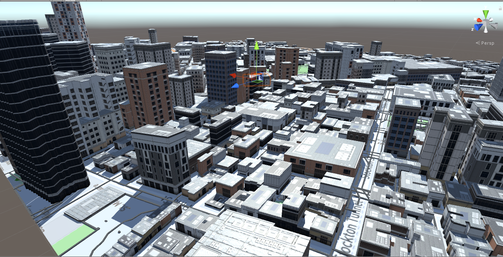
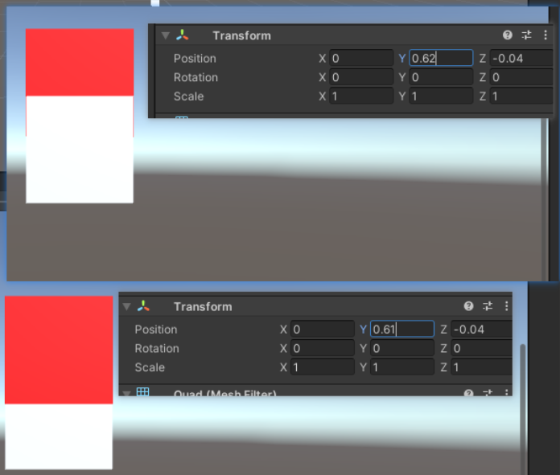
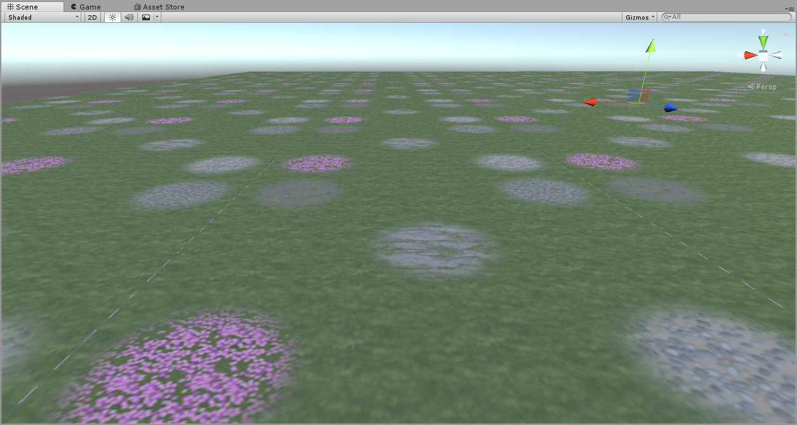
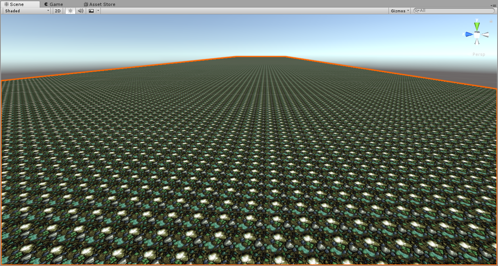
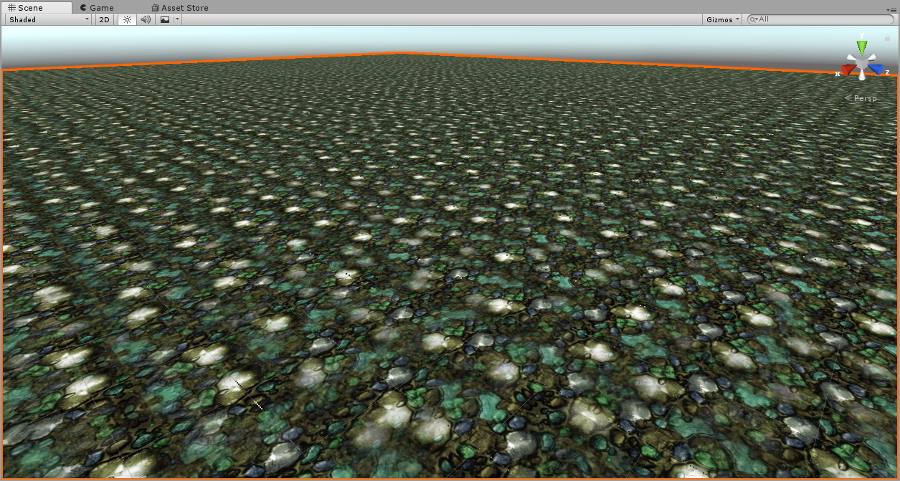
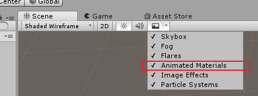
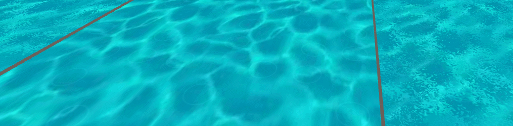
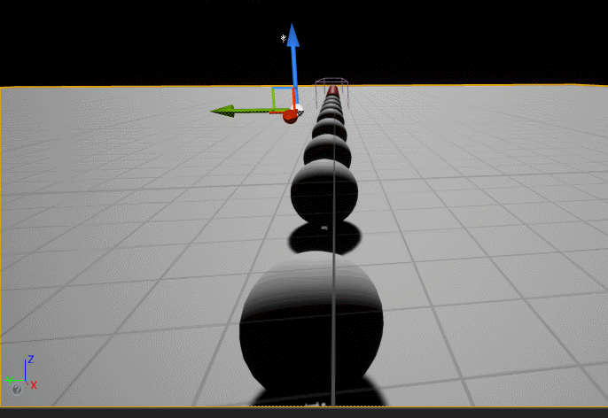
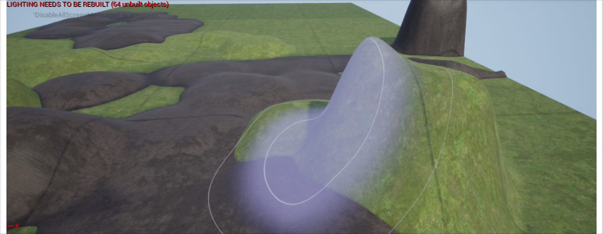
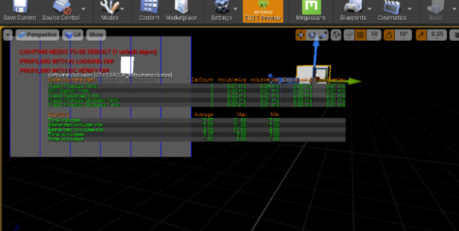

# Demo

## 1️⃣、Unity

### 1.Mapbox2017

### 2.progressive

### 3.TransparencySort

### 4.Terrain2017

<http://candycat1992.github.io/2016/11/28/blend-terrain-textures/>

### 5、消除纹理重复

<http://candycat1992.github.io/2016/11/29/texture-repetition/>
1.拿噪声纹理得到随机tile的随机方向 和 随机平移 
2.模糊交界处
Repeate

texturenorepeate1

texturenorepeate2

### 6、water

uunity trick Editor模式下看材质动态

<https://github.com/kb824999404/Unity_Shader/blob/master/Shader/Test/Water/SimpleWater.shader>

todo 水花
<https://codeantenna.com/a/HS29K4bB0m>

## 2️⃣、Unreal

### 1. CullDistance

### 2. landscape1.25

### 3. soc

