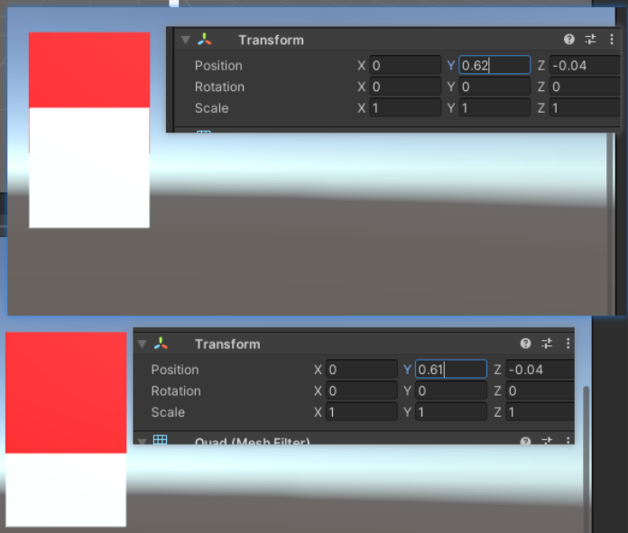
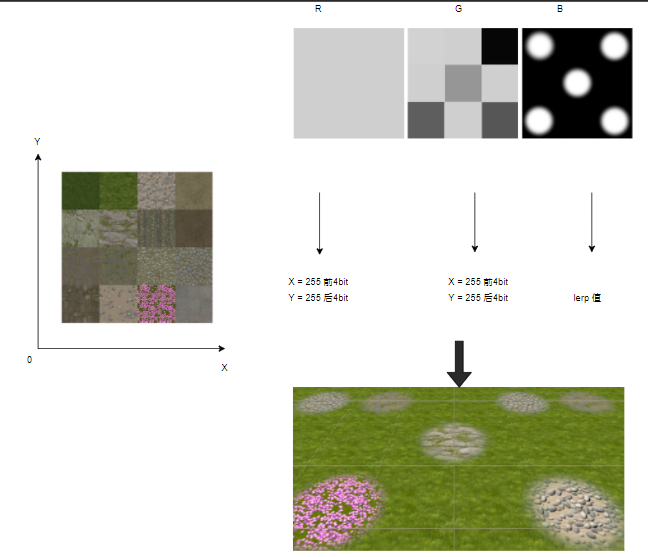
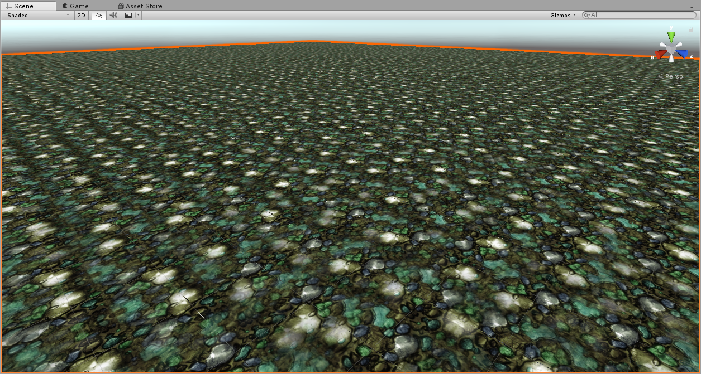
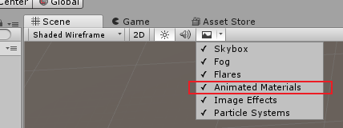
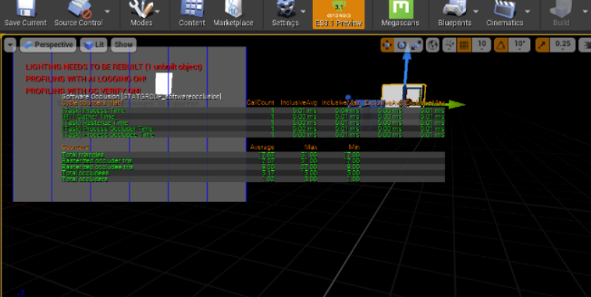
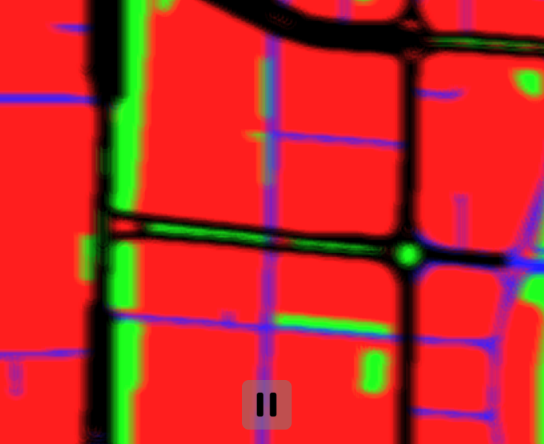

# 展示

[TOC]

## 1️⃣、Unity

### 1.Unity\Mapbox2017

### 2.Unity\progressive

### 3.Unity\TransparencySort

### 4.Unity\ShaderEffect\Asset\TerrainMultiTexture

<http://candycat1992.github.io/2016/11/28/blend-terrain-textures/>

### 5、Unity\ShaderEffect\Asset\TerrainTextureRepeate

<http://candycat1992.github.io/2016/11/29/texture-repetition/>

1.拿噪声纹理得到随机tile的随机方向 和 随机平移
2.模糊交界处
Repeate

texturenorepeate1

texturenorepeate2

### 6、Unity\ShaderEffect\Asset\water

uunity trick Editor模式下看材质动态

<https://github.com/kb824999404/Unity_Shader/blob/master/Shader/Test/Water/SimpleWater.shader>

1. 简单的水

2. 水波纹

todo 水花
<https://codeantenna.com/a/HS29K4bB0m>

## 2️⃣、Unreal

### 1. Unreal\CullDistance

### 2. Unreal\landscape1.25

### 3. Unreal\soc

## 3️⃣、ShaderToy

### 1.Blur

### 2.Terrain

