# 后处理

|后处理|介绍||
|-|-|-|
|1.Bloom|Bloom通常会搭配HDR ToneMapping||

## 后处理前置知识
#### 1.模糊
##### 高斯模糊
高斯模糊简单的说就是对整副图像进行加权平均。
1. 先了解下卷积，卷积运算。
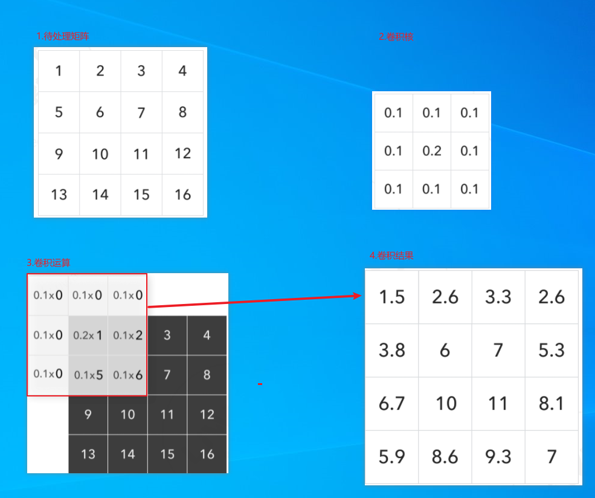
2. 高斯分布函数
一维高斯：
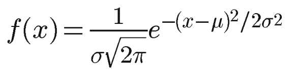
二维高斯：
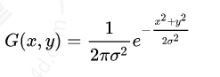
归一化二维高斯：
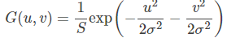

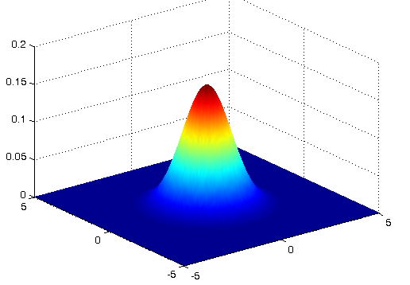
【注】μ是x的均值，σ是x的方差 因为计算平均值的时候，中心点就是原点，所以μ等于0。
在这个[博客](https://www.cnblogs.com/invisible2/p/9177018.html)看到的
sigma = 0.3*((ksize-1)*0.5 - 1) + 0.8 

**实用:**
3*3的高斯卷积核：
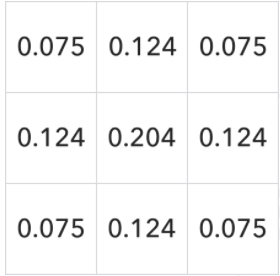

**优化：**
1. 分步两次一维运算算法及其实现,
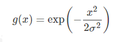
:arrow_right:
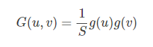
:arrow_right:
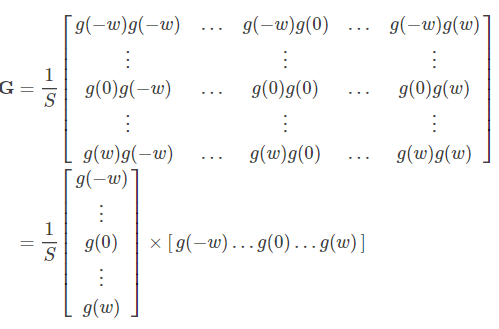
:arrow_right:
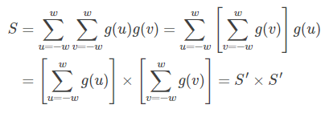
:arrow_right:
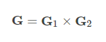
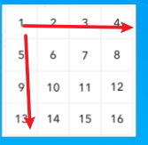

2.

#### 2.LDR HDR ToneMapping ACES 
LDR(Low-Dynamic Range) RGB 每个通道是8bit 那么可以代表2^8^3的颜色
HDR(High-Dynamic Range) 2^12^3 通过ToneMapping(例如ACES) 映射到LDR
介绍4中ToneMapping:
https://zhuanlan.zhihu.com/p/21983679
颜色可以继续参考
https://edu.uwa4d.com/course-intro/0/181
