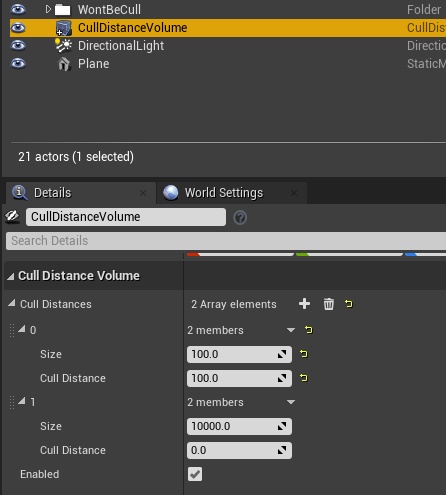
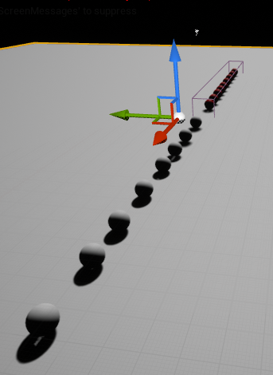
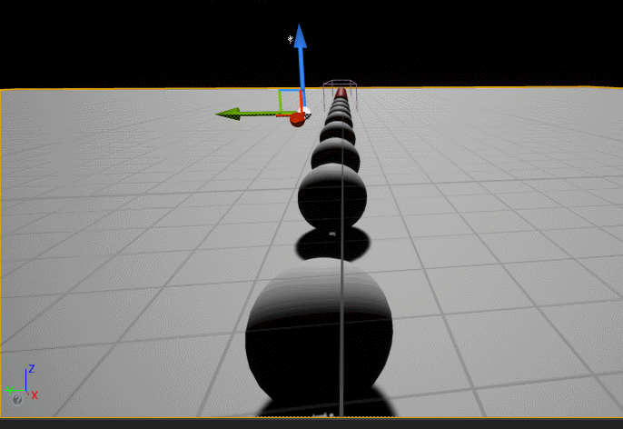

# CullDistance

## 摆放物件

1. 红色的是在CullDistanceVolume里面的 CullDistanceVolume 通过scale 和 pos调整来囊括这些红色球体
2. 设置CullDistanceVolume 参数
下面表示 大小100的物体在大于100cm的时候会被裁剪 大于1000的物体永远不会被裁剪

这个是摆放后的场景

## 播放一下
白色球体不在CullDistanceVolume里面所以不受影响一直是可见的 红色球体距离大于100cm的时候是不可见的 当镜头拉近才看到。

