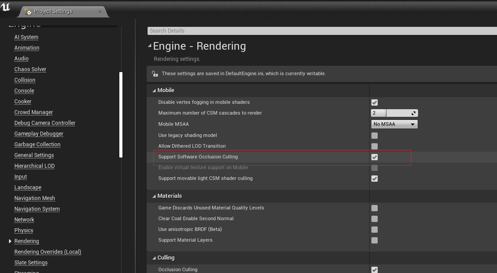
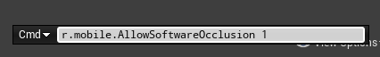
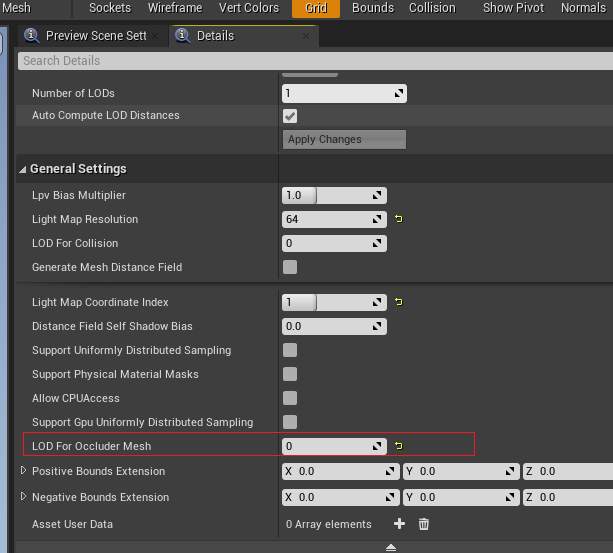
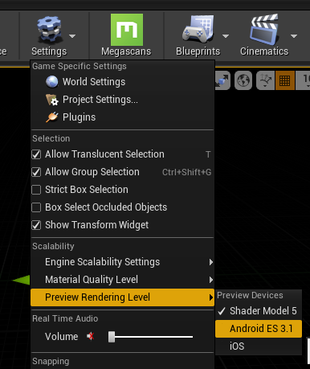
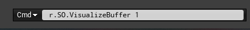
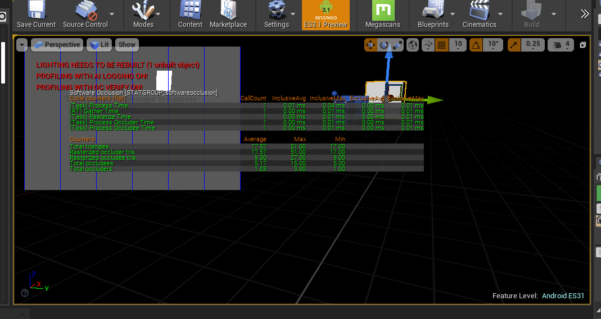

# 软光栅剔除demo

https://docs.unrealengine.com/4.26/zh-CN/RenderingAndGraphics/VisibilityCulling/SoftwareOcclusionQueries/

1、项目设置

或者这里设置 r.mobile.AllowSoftwareOcclusion 1

2、Mesh设置
在静态网格体编辑器中，使用 细节（Details） 面板，并将任何值设置为0或更大的值来启用 遮挡物网格体的LOD（LOD for Occluder Mesh）。

3、移动预览器

4、预览
r.SO.VisualizeBuffer 1 

5、查看性能数据
stat softwareocclusion

6、结果
