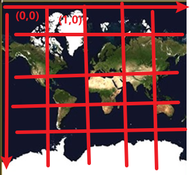
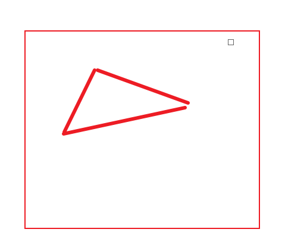
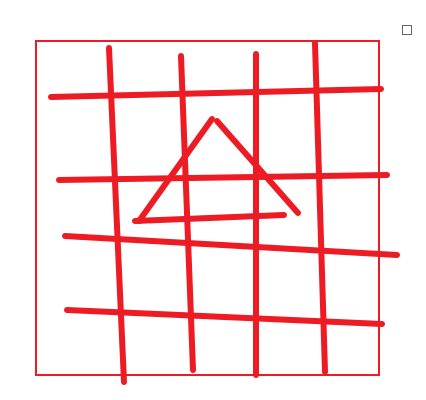
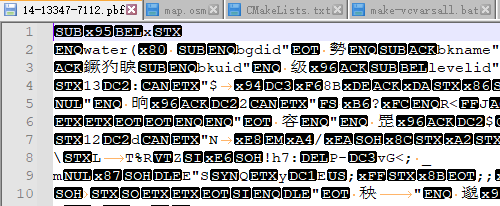
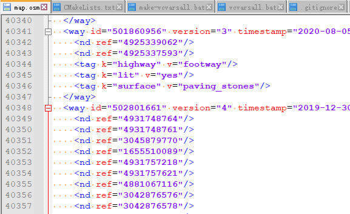

# 梳理下几种概念（mvt pbf osm MBTiles）

## 1、mvt

mapbox vector tiles，这个是组织结构，vector是向量的意思，体现在两个方面：
（1）几何数据向量化
每个Tile有个TileIDX TileIDY 会跟经纬度有个对应，根据这个TileID就可以知道这个Tile的经纬度，和这个tile在世界的位置

tile内不的坐标是内部的向量

例如Tile被分割成5x5 

三角形的三个点的坐标就出来了 存储的点都是内部tile的坐标系的向量

（2）Properties向量化：
简单的说就是，用id来替代字符串，减少文件大小。例如："店名":"星巴克" 很多叫星巴克的地方把"星巴克"定义为id 1，那么多个地方只要标记是1 然后再去字符串表里面查1的字符串

Properties向量化可以看下pb协议是怎么定义的4.5. 示例 
<https://github.com/mapbox/vector-tile-spec/blob/master/2.1%2Fvector_tile.proto>

## 2、pbf

pdf就是文件协议  就是protocol buff的意思
可以看pb定义
<https://github.com/mapbox/vector-tile-spec/blob/master/2.1%2Fvector_tile.proto>

## 3、osm

openstreetmap下载到的是明文格式，这个不  确定是不是 mvt的结构

## 4、MBtile

这个是图片的管理方式
<https://blog.csdn.net/tangshenq17565/article/details/102629395>
